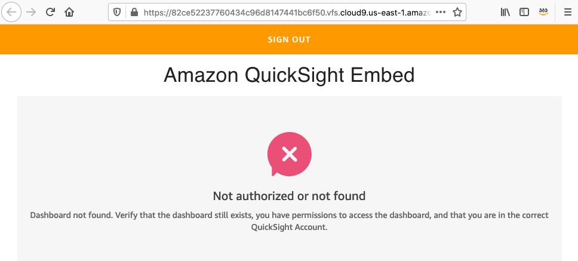
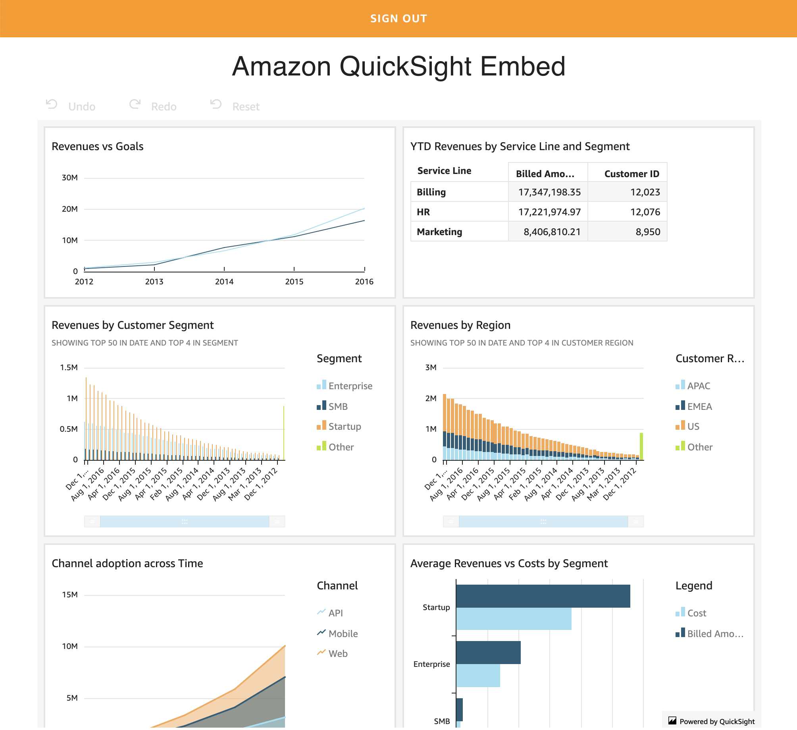

# Create a React project from scratch and deploy with Amplify

Work inside your AWS Cloud9 or local environment.

## Requirements

* AWS Account with Quicksight Enterprise Edition
* QuickSight Dashboard created

## Configure your environment

Inside the Cloud9 environment, in the **bash** terminal we are going to configure the AWS CLI as follows:

``` bash
aws configure
```

- Configuration:
    - AWS Access Key ID: **(Use default value)**
    - AWS Secret Access Key: **(Use default value)**
    - Default region name [us-east-1]: **us-east-1**
    - Default output format [json]: **json**

## Install dependencies and create the React project

Update Node.js to the minimal version of 10.

``` bash
nvm i v10
```

Install Amplify CLI tool https://github.com/aws-amplify/amplify-cli

``` bash
npm install -g @aws-amplify/cli
```

Create the React project.

``` bash
npx create-react-app amplify-quicksight-dashboard-embedded
cd amplify-quicksight-dashboard-embedded
npm install @material-ui/core
npm install --save aws-amplify
npm install --save aws-amplify-react
npm install react-router-dom
npm install amazon-quicksight-embedding-sdk
```

## Initialize your project with Amplify

``` bash
amplify init
```

? Enter a name for the project **amplifyquicksightdas**

? Enter a name for the environment **dev**

? Choose your default editor: **Sublime Text**

? Choose the type of app that you're building **javascript**

Please tell us about your project

? What javascript framework are you using **react**

? Source Directory Path:  **src**

? Distribution Directory Path: **build**

? Build Command:  **npm run-script build**

? Start Command: **npm run-script start**

Using default provider  awscloudformation

For more information on AWS Profiles, see:

https://docs.aws.amazon.com/cli/latest/userguide/cli-multiple-profiles.html

? Do you want to use an AWS profile? **Yes**

? Please choose the profile you want to use **default**

## Authentication with Amazon Cognito

By adding Analytics, the authentication module was added. Update with the following command using the default values.

``` bash
amplify auth add
```
? Do you want to use the default authentication and security configuration? **Default configuration**

 Warning: you will not be able to edit these selections. 

? How do you want users to be able to sign in? **Username**

? Do you want to configure advanced settings? **No, I am done.**

## Hosting with Amazon S3

``` bash
amplify add hosting
```

? Select the environment setup: **DEV (S3 only with HTTP)**

? hosting bucket name **myapp-20190710043203-hostingbucket** (Use default name)

? index doc for the website **index.html**

? error doc for the website **index.html**

``` bash
amplify push
```

? Are you sure you want to continue? **Yes**

``` bash
amplify publish
```

Use the **Hosting endpoint** to browse inside your React application.

## Add Lambda Function

``` bash
amplify add function
```

? Provide a friendly name for your resource to be used as a label for this category in the project: getQuickSightDashboardEmbedURL

? Provide the AWS Lambda function name: getQuickSightDashboardEmbedURL

? Choose the function template that you want to use: Serverless express function (Integration with Amazon API Gateway)

? Do you want to access other resources created in this project from your Lambda function? No

? Do you want to edit the local lambda function now? No

``` bash
amplify publish
```

## Add API  REST

amplify add api

? Please select from one of the below mentioned services REST

? Provide a friendly name for your resource to be used as a label for this category in the project: quicksight

? Provide a path (e.g., /items) /getQuickSightDashboardEmbedURL

? Choose a Lambda source Use a Lambda function already added in the current Amplify project

? Choose the Lambda function to invoke by this path quicksight

? Restrict API access Yes

? Who should have access? Authenticated users only

? What kind of access do you want for Authenticated users? read

? Do you want to add another path? No

And publish the changes.

``` bash
amplify publish
```

## Configure the React application

For the file **src/App.js**, replace the content with the following lines.

``` javascript
import React from 'react';
import { BrowserRouter as Router, Route, Link } from "react-router-dom";

import Embed from './Embed';
import './App.css';

import Amplify from 'aws-amplify';
import Auth from '@aws-amplify/auth';

import { withAuthenticator } from 'aws-amplify-react';

import awsconfig from './aws-exports';

Auth.configure(awsconfig);
Amplify.configure(awsconfig)

function App() {
  return (
    <Router>
      <div className="App">
        <Route path="/" component={Embed} exact />
      </div>
    </Router>
  );
}

export default withAuthenticator(App);
```

Create the file **src/Embed.js** and add the following lines.

``` javascript
import React from 'react';
import { API } from 'aws-amplify';
import { Auth } from 'aws-amplify';

var QuickSightEmbedding = require("amazon-quicksight-embedding-sdk");

const Embed = ({}) => {
    
    var jwtToken;
    var payloadSub;
    var email;
    
    Auth.currentSession()
    .then(data => { console.log(data); jwtToken = data.idToken.jwtToken; payloadSub = data.idToken.payload.sub; email = data.idToken.payload.email; console.log(jwtToken + " - " + payloadSub + " - " + email); } )
    .catch(err => console.log(err));
    
    async function handleClick(e) {
        e.preventDefault();
        let myInit = { // OPTIONAL
            headers: {}, // OPTIONAL
            response: true, // OPTIONAL (return the entire Axios response object instead of only response.data)
            queryStringParameters: {  // OPTIONAL
                jwtToken: jwtToken,
                payloadSub: payloadSub,
                email: email
            }
        }
        const data = await API.get('quicksight', '/getQuickSightDashboardEmbedURL', myInit);
        console.log(data);
        var containerDiv = document.getElementById("dashboardContainer");
        var dashboard;
        var options = {
            url: data.data.data.EmbedUrl,
            container: containerDiv,
            parameters: {
                country: "United States"
            },
            scrolling: "no",
            height: "700px",
            width: "1000px"
        };
        dashboard = QuickSightEmbedding.embedDashboard(options);
    }
    return (
        <>
        <h1>Quicksight Embed </h1>
        <div id="dashboardContainer"></div>
        <a href="#" onClick={handleClick}>
          Show me the Dashboard!!!!!
        </a>
        </>
    );
}

export default Embed;
```

In the file **amplify/backend/function/getQuickSightDashboardEmbedURL/getQuickSightDashboardEmbedURL-cloudformation-template.json** add the following lines to the **lambdaexecutionpolicy** resource in the **PolicyDocument** property.

``` json
						{
							"Effect": "Allow",
							"Action": [
								"sts:AssumeRoleWithWebIdentity"
							],
							"Resource": "*"
						},
                        {
                            "Effect": "Allow",
                            "Action": [
                                "cognito-identity:GetId",
                                "cognito-identity:GetOpenIdToken"
                            ],
                            "Resource": "*"
                        }
```

Install the dependencie **amazon-cognito-identity-js** for your backend function **getQuickSightDashboardEmbedURL**.

``` bash
cd amplify/backend/function/getQuickSightDashboardEmbedURL/src/
npm install amazon-cognito-identity-js
cd ../../../../../
```

For the file **amplify/backend/function/getQuickSightDashboardEmbedURL/src/app.js** replace the content with the following lines.

Inside the code replace the following values with your owns:

* <cognito-authenticated-role>
* <identity-pool-id>
* <user-pool-id>
* <account-id>
* <dashboard-id>

``` javascript
var express = require('express')
var bodyParser = require('body-parser')
var awsServerlessExpressMiddleware = require('aws-serverless-express/middleware')

var AWS = require('aws-sdk');
var AmazonCognitoIdentity = require('amazon-cognito-identity-js');
const https = require('https');

// declare a new express app
var app = express()
app.use(bodyParser.json())
app.use(awsServerlessExpressMiddleware.eventContext())

// Enable CORS for all methods
app.use(function(req, res, next) {
  res.header("Access-Control-Allow-Origin", "*")
  res.header("Access-Control-Allow-Headers", "Origin, X-Requested-With, Content-Type, Accept")
  next()
});

/**********************
 * getQuickSightDashboardEmbedURL get method *
 **********************/

app.get('/getQuickSightDashboardEmbedURL', function(req, res) {

    var roleArn = '<cognito-authenticated-role>'; // your cognito authenticated role arn here
  
    AWS.config.region = 'us-east-1';
  
    var sessionName = req.query.payloadSub;
    var cognitoIdentity = new AWS.CognitoIdentity();
    var stsClient = new AWS.STS();
    var params = {
        IdentityPoolId: '<identity-pool-id>', // your identity pool id here
        Logins: {
            // your logins here
            'cognito-idp.us-east-1.amazonaws.com/<user-pool-id>': req.query.jwtToken
        }
    };
    
    cognitoIdentity.getId(params, function(err, data) {
        if (err) console.log(err, err.stack);
        else {
            data.Logins = {
                // your logins here
                'cognito-idp.us-east-1.amazonaws.com/<user-pool-id>': req.query.jwtToken
            };

            cognitoIdentity.getOpenIdToken(data, function(err, openIdToken) {
                if (err) {
                    console.log(err, err.stack);
                    //callback(err);
                    res.json({
                      err
                    })
                } else {
                    let stsParams = {
                        RoleSessionName: sessionName,
                        WebIdentityToken: openIdToken.Token,
                        RoleArn: roleArn
                    }
                    stsClient.assumeRoleWithWebIdentity(stsParams, function(err, data) {
                        if (err) {
                            console.log(err, err.stack);
                            //callback(err);
                            res.json({
                              err
                            })
                        } else {
                            AWS.config.update({
                                region: 'us-east-1',
                                credentials: {
                                    accessKeyId: data.Credentials.AccessKeyId,
                                    secretAccessKey: data.Credentials.SecretAccessKey,
                                    sessionToken: data.Credentials.SessionToken,
                                    expiration: data.Credentials.Expiration
                                }
                            });
                            var registerUserParams = {
                                // required
                                AwsAccountId: "<account-id>",
                                // can be passed in from api-gateway call
                                Email: req.query.email,
                                // can be passed in from api-gateway call
                                IdentityType: 'IAM',
                                // can be passed in from api-gateway call
                                Namespace: 'default',
                                // can be passed in from api-gateway call
                                UserRole: 'READER',
                                IamArn: roleArn,
                                SessionName: sessionName
                            };
                            var quicksight = new AWS.QuickSight();
                            quicksight.registerUser(registerUserParams, function(err, data) {
                                if (err) {
                                    console.log("3");
                                    console.log(err, err.stack); // an error occurred
                                    if (err.code && err.code === 'ResourceExistsException') {
                                      var getDashboardParams = {
                                            // required
                                            AwsAccountId: "<account-id>",
                                            // required
                                            DashboardId: "<dashboard-id>",
                                            // required
                                            IdentityType: 'IAM',
                                            ResetDisabled: false, // can be passed in from api-gateway call
                                            SessionLifetimeInMinutes: 100, // can be passed in from api-gateway call
                                            UndoRedoDisabled: false // can be passed in from api-gateway call
                                        };
                                        var quicksightGetDashboard = new AWS.QuickSight();
                                        quicksightGetDashboard.getDashboardEmbedUrl(getDashboardParams, function(err, data) {
                                            if (err) {
                                                console.log(err, err.stack); // an error occurred
                                                  res.json({
                                                    err
                                                  })
                                            } else {
                                                console.log(data);
                                                res.json({
                                                  data
                                                })
                                            }
                                        });
                                    } else {
                                      res.json({
                                        err
                                      })
                                    }
                                } else {
                                    // successful response
                                    setTimeout(function() {
                                    var getDashboardParams = {
                                          // required
                                          AwsAccountId: "<account-id>",
                                          // required
                                          DashboardId: "<dashboard-id>",
                                          // required
                                          IdentityType: 'IAM',
                                          ResetDisabled: false, // can be passed in from api-gateway call
                                          SessionLifetimeInMinutes: 100, // can be passed in from api-gateway call
                                          UndoRedoDisabled: false // can be passed in from api-gateway call
                                      };
                                  
                                      var quicksightGetDashboard = new AWS.QuickSight();
                                      quicksightGetDashboard.getDashboardEmbedUrl(getDashboardParams, function(err, data) {
                                          if (err) {
                                              console.log(err, err.stack); // an error occurred
                                                res.json({
                                                  err
                                                })
                                          } else {
                                              console.log(data);
                                              res.json({
                                                data
                                              })
                                          }
                                      });
                                        
                                    }, 2000);
                                    
                                }
                            });
                            
                        }
                    });
                }
            });
        }
    });

});

app.listen(3000, function() {
    console.log("App started")
});

module.exports = app
```

Identify your **AuthRole** assigned to your Identity Pool and assign the following inline policy.

``` json
{
    "Version": "2012-10-17",
    "Statement": [
        {
            "Action": "quicksight:RegisterUser",
            "Resource": "*",
            "Effect": "Allow"
        },
        {
            "Action": "quicksight:GetDashboardEmbedUrl",
            "Resource": "*",
            "Effect": "Allow"
        }
    ]
}
```

Publish the changes to update the application.

``` bash
amplify publish
```

Once you show the dashboard you will see the message following **"Not authorized or not found"**.



You will find a new user added to Quicksight, just add the user to the Dashboard and show the dashboard again.

Managed dashboard sharing: https://docs.aws.amazon.com/quicksight/latest/user/sharing-a-dashboard.html#share-a-dashboard

